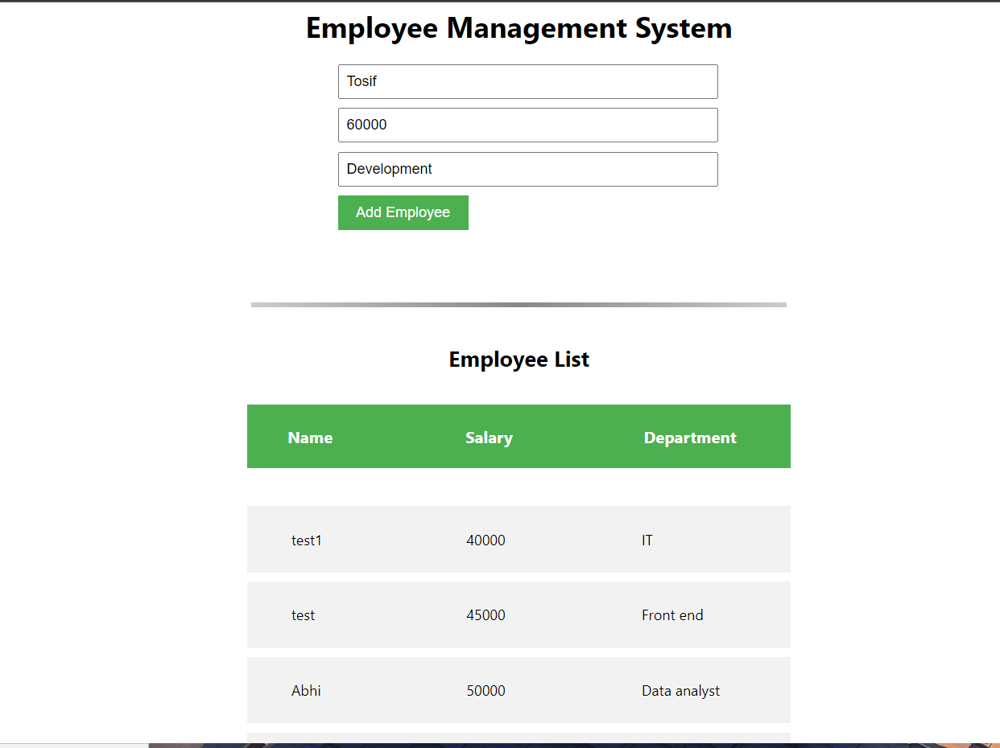

# Employee Management System

## Screenshot



## Overview
This project is an Employee Management System that allows users to add employees with details such as name, salary, and department. It also provides functionality to list all added employees.

## Technologies Used
- React: Frontend framework for building the user interface.
- Node.js: Backend runtime environment for running the server.
- MongoDB: Database system for storing employee data.

## Getting Started
1. **Clone the repository** to your local machine.

2. **Backend Setup:**
   - Navigate to the `backend` directory and install the required packages by running:
     ```
     cd backend
     npm install
     ```
   - Start the server by running:
     ```
     nodemon server.js
     ```
     The server will start at `localhost:5000`.

3. **Frontend Setup:**
   - Open a new terminal window, **navigate to the frontend directory**, and install the required packages by running:
     ```
     cd ../frontend
     npm install
     ```
   - Start the frontend by running:
     ```
     npm start
     ```
     This will start the frontend server at `localhost:3000`.

## Usage
- To add a new employee:
  - Navigate to `localhost:3000`.
  - Fill out the employee details in the provided form (name, salary, department) and submit the form.
- To list all added employees:
  - Navigate to `localhost:3000`.
  - The list of all added employees will be displayed below the form.

